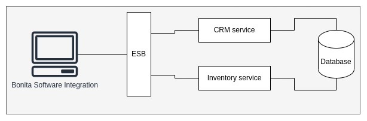

# Enterprise Service Bus Example



## CRM Web Service

### Add Client

```shell
curl --location --request POST 'http://localhost:3000/client' \
--header 'Content-Type: application/json' \
--data-raw '{
    "fullname": "Álvaro Stagg",
    "email": "astagg@unbosque.edu.co",
    "phone": "0123456789"
}'
```

### List Clients

```shell
curl --location --request GET 'http://localhost:3000/client'
```

## Inventory Web Service

### Add Item

```shell
curl --location --request POST 'http://localhost:3060/items' \
--header 'Content-Type: application/xml' \
--data-raw '<item>
    <name>Sopa</name>
    <stock>11</stock>
</item>'
```

### List Items

```shell
curl --location --request GET 'http://localhost:3060/items'
```

## License

This is an education project for our Software Engineer III course. This may project
may not be used under production environments and will no receive any update after
we've approved our course.

## Authors

- Antonio José Mata Rodríguez (amata@unbosque.edu.co)
- Álvaro Antonio Stagg Ramírez (astagg@unbosque.edu.co)
